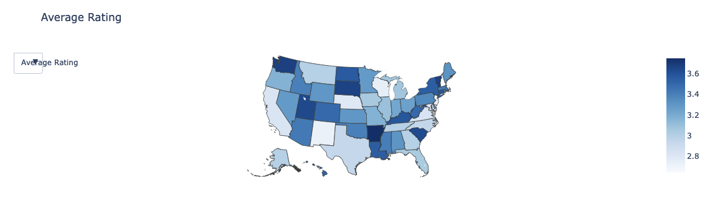
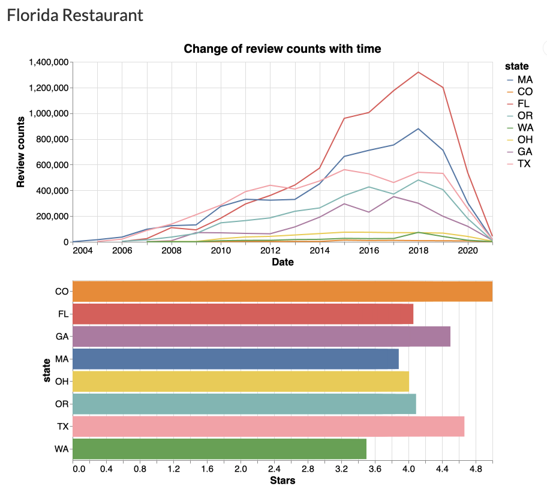
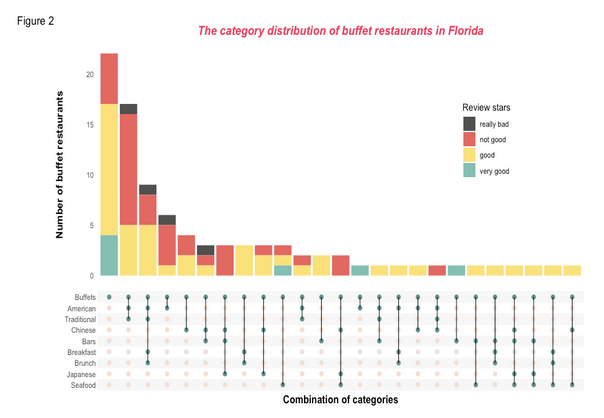
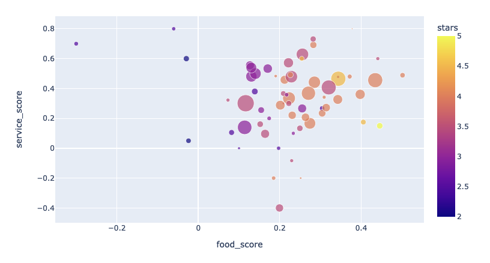
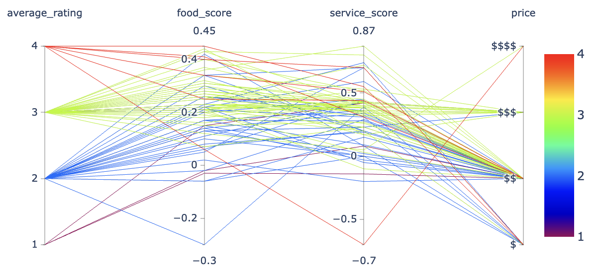

# Final Write-Up

## How have our visualization goals changed from the project proposal?

We are interested in what makes a restaurant good. Once the restaurant owners know about the significant factors, they can improve their restaurant in an efficient way. Compared with a general restaurant analysis, we think diving deeper into a specific type of restaurant can provide more interesting insights and practical suggestions. In this case, buffet restaurants are a good analysis choice because they are a niche market with great popularity. In addition, because each buffet restaurant provides distinctive food and services, it gives us more dimensions to analyze what makes a restaurant good.

Generally, there are general factors for a restaurant, such as food, service, location, price, etc. For buffets, the diversity of food may be a significant factor, like some restaurants may serve lobster and steak, while others may serve sushi and seafood. Factors like music, interior design, and parking lot are also worthwhile to explore. 

Rating is a noticeable and direct index to reflect customer experience. And by analyzing the customer reviews in our dataset, we are able to assess restaurant quality from different angles.

## Descriptions of Visualization Interface

0. Webpage Organization

1. Buffet Restaurant Counts by State: Choropleth Chart

Before diving deep into the dataset, it’s good to have a brief view at the rough geospatial feature of our dataset. Thus, we first created the choropleth plot which contains phases of restaurant count, average rating and average review count in different states. While the color scale directly indicates the values in each state, if we hover over a certain state, the exact value of the variable will show.

2. Buffet Restaurant Ratings Over time: Line Chart

Another angle from which we would like to explore the dataset is the time pattern. While traditional line plot seems boring, we choose an interactive line plot in which once we box select a certain part of the multiple line plot, a corresponding barplot will update and show below the line plot. By interacting with the plot, the user can explore the time parts he or she is interested in directly.

3. Buffet Restaurant Rating by Category: Upset Chart

The upset plot is aimed to provide us with information about the category distribution of Florida buffet restaurants, and how the category affects the rating of these restaurants. It is designed in a clear and intuitive way to show rich information with color, dot, bar, and line mapping. 

4. Buffet Restaurant Rating by Food and Service Score: Scatter Plot Chart

A scatter plot is used to show the relationship of these factors to the review stars and the popularity of the restaurants. The color is mapped to the review stars and the size of the dots represents the review counts. If a user is interested in a specific data point, they can hover over the data and see the specific restaurant name.

5. Buffet Restaurant Rating by Other Factors: Parallel Coordinate Plot

Parallel Coordinates Plot can be a good starting point of adding more factors to the analysis. This plot is used for plotting multivariate numerical data and finding out the relationship between them. The price variable is added to the plot. The price axis is placed in parallel to the food score and the service score axis. Each line show the individual observation (restaurant) and the color of the line represents the average rating of the restaurants.

## Data Source

The public Yelp dataset:

The Yelp dataset is an open dataset that contains the businesses, reviews, and user data from 8 metropolitan areas.                                             
Public Dataset Link: https://www.yelp.com/dataset

Documentation: https://www.yelp.com/dataset/documentation/main 

Dataset collected using Yelp Fusion API

We used the Yelp Fusion API to collect more data on buffet restaurants in different states of the United States.
Yelp Fusion Platform: https://www.yelp.com/developers/documentation/v3/get_started

## Data Preprocessing

| Data Collection               | Yelp public dataset and Yelp Fusion API      |
|-------------------------------|----------------------------------------------|
| Data Munging                  | Filter data to buffet restaurants in Florida |
| Data subsetting for each plot | Create specialized dataset for plotting      |
| Visualization                 | Altair, plotly, ggupset, ggplot2 package,    |
